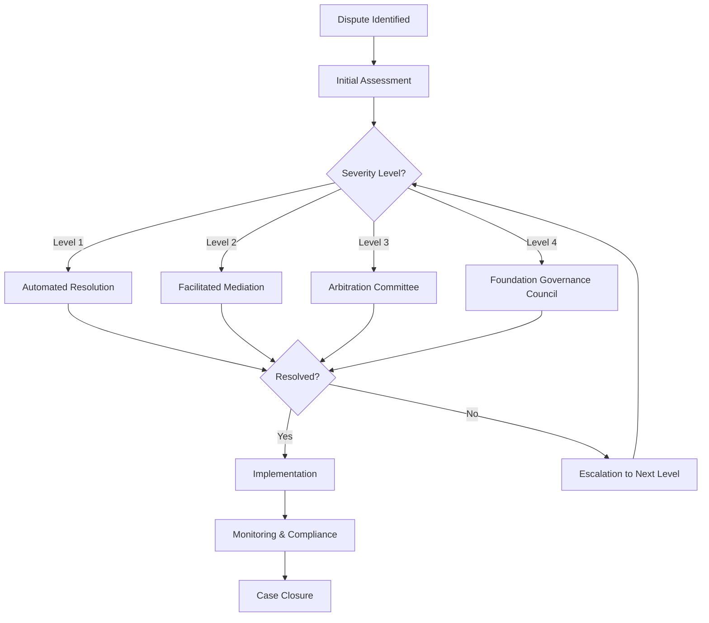

# Verification Dispute Resolution

# Verification Dispute Resolution Protocol

## Executive Summary

The Verification Dispute Resolution Protocol (VDRP) is a critical component of FICTRA's verification infrastructure, designed to resolve conflicts that arise during the verification of commodity transactions. This document provides comprehensive guidance on the dispute resolution framework, including technical implementation, procedural workflows, governance considerations, and system integration.

The VDRP balances several key objectives:
- Maintaining the integrity of the verification system
- Ensuring fair and transparent resolution processes
- Providing timely resolutions to minimize market disruption
- Creating appropriate escalation pathways
- Protecting the interests of all stakeholders

This document serves as the definitive internal resource for understanding and implementing the dispute resolution mechanisms within FICTRA's verification ecosystem.

## 1. Fundamentals of Verification Disputes

### 1.1 Nature and Scope of Verification Disputes

Verification disputes in the FICTRA ecosystem typically arise from discrepancies or disagreements related to:

- **Data Discrepancy**: Conflicting information about commodity quantity, quality, or specifications
- **Documentation Conflicts**: Inconsistencies in shipping documents, customs records, or inspection certificates
- **Oracle Divergence**: Contradictory data from different verification oracle sources
- **Timing Issues**: Disputes about delivery dates, verification delays, or sequence of events
- **Jurisdictional Questions**: Disagreements about which regulatory frameworks apply
- **Technical Failures**: System malfunctions that affect verification data collection or transmission
- **Process Violations**: Claims that verification procedures were not properly followed
- **Fraud Allegations**: Accusations of deliberate misrepresentation or tampering

### 1.2 Impact on Token Allocation

Verification disputes directly impact the foundation of FICTRA's dual-token system:

| Dispute Outcome | Impact on Payment Token (PT) | Impact on Foundation Token (FT) |
|-----------------|------------------------------|----------------------------------|
| Verification Upheld | PT transaction proceeds normally | FT allocation to sovereign entity as planned |
| Verification Rejected | PT either returned to buyer or held in escrow pending resolution | FT allocation suspended until resolution |
| Partial Verification | PT partially released based on verified portion | FT allocated proportionally to verified amount |
| Extended Dispute | PT locked in smart contract escrow | FT allocation delayed, potentially affecting sovereign planning |

### 1.3 Risk Assessment Matrix

The following matrix categorizes disputes by severity and complexity:

| Severity Level | Description | Time Sensitivity | Example Scenarios |
|----------------|-------------|------------------|-------------------|
| Level 1 (Minor) | Simple discrepancies with minimal financial impact | Low (7-14 days) | Small quantity variances, documentation typos, delayed timestamps |
| Level 2 (Moderate) | Material disputes requiring investigation | Medium (3-7 days) | Quality specification disputes, partial delivery verification, inconsistent oracle data |
| Level 3 (Significant) | Major disputes with substantial financial implications | High (1-3 days) | Large quantity discrepancies, multiple conflicting documents, serious allegation of procedural violation |
| Level 4 (Critical) | System-threatening disputes or fraud allegations | Urgent (24-48 hours) | Suspected fraud, complete verification failure, major system technical failures |

## 2. Technical Infrastructure

### 2.1 Dispute Management System Architecture

The VDRP is implemented through a specialized technical infrastructure:

```
┌─────────────────────────┐     ┌────────────────────────┐     ┌───────────────────────┐
│                         │     │                        │     │                       │
│   Dispute Submission    │────▶│   Dispute Processing   │────▶│   Resolution Engine   │
│   Interface             │     │   Pipeline             │     │                       │
│                         │     │                        │     │                       │
└─────────────────────────┘     └────────────────────────┘     └───────────────────────┘
           ▲                               ▲                              ▲
           │                               │                              │
           │                               │                              │
           ▼                               ▼                              ▼
┌─────────────────────────┐     ┌────────────────────────┐     ┌───────────────────────┐
│                         │     │                        │     │                       │
│   Evidence Repository   │◀───▶│   Oracle Network      │◀───▶│   Smart Contract      │
│                         │     │   Interface            │     │   System             │
│                         │     │                        │     │                       │
└─────────────────────────┘     └────────────────────────┘     └───────────────────────┘
```

### 2.2 Core Components

#### 2.2.1 Dispute Submission Interface

- **Implementation**: React-based front-end application with secure API connections
- **Authentication**: Multi-factor authentication with role-based access control
- **Key Functions**:
  - Structured dispute submission forms with mandatory fields
  - Evidence upload capabilities (supporting documents, images, sensor data)
  - Real-time validation of submission completeness
  - Automatic categorization based on dispute characteristics
  - Dispute ID generation and tracking system

#### 2.2.2 Evidence Repository

- **Implementation**: Distributed storage system with IPFS integration
- **Security Features**:
  - Immutable storage with cryptographic validation
  - Timestamping of all submissions
  - Granular access control based on dispute participants
  - Document fingerprinting to prevent tampering
- **Retention Policies**: 7-year minimum storage with cryptographic proof of existence

#### 2.2.3 Dispute Processing Pipeline

- **Implementation**: Microservices architecture with event-driven processing
- **Key Functions**:
  - Automated notification system for all relevant parties
  - Case management workflow engine
  - Timeframe monitoring and escalation triggers
  - Integration with verification oracle network
  - Audit logging of all dispute-related activities

#### 2.2.4 Oracle Network Interface

- **Implementation**: Chainlink-based oracle system with custom FICTRA adapters
- **Key Functions**:
  - Retrieval of original verification data from multiple sources
  - Secondary verification request capabilities
  - Oracle consensus mechanisms for dispute evaluation
  - Historical data access for comparative analysis

#### 2.2.5 Resolution Engine

- **Implementation**: Rules-based system with ML-assisted decision support
- **Key Functions**:
  - Automated resolution for standard dispute patterns
  - Decision tree analysis for complex cases
  - Precedent database for consistency in rulings
  - Integration with governance voting mechanisms
  - Resolution document generation

#### 2.2.6 Smart Contract System

- **Implementation**: Ethereum-based smart contracts for token management
- **Key Functions**:
  - Escrow management for disputed PTs
  - Conditional release mechanisms based on resolution outcomes
  - FT allocation adjustment protocols
  - Time-locked execution of resolutions
  - Event emission for system-wide transparency

### 2.3 Data Models

#### 2.3.1 Dispute Case Schema

```json
{
  "disputeId": "VDRP-2025060112345",
  "creationTimestamp": "2025-06-01T12:34:56Z",
  "status": "UNDER_REVIEW",  // SUBMITTED, UNDER_REVIEW, PENDING_EVIDENCE, RESOLVED, APPEALED
  "severityLevel": 2,
  "category": "DATA_DISCREPANCY",
  "relatedTransactionId": "TRX-20250531-ABC123",
  "commodityDetails": {
    "type": "WHEAT",
    "quantity": "5000MT",
    "quality": "Premium Hard Red Winter",
    "origin": "United States",
    "destination": "Egypt"
  },
  "disputeInitiator": {
    "participantId": "PART-EGY-GOV-001",
    "participantType": "SOVEREIGN_ENTITY"
  },
  "respondent": {
    "participantId": "PART-US-SUP-042",
    "participantType": "SUPPLIER"
  },
  "disputeDetails": {
    "summary": "Quantity discrepancy between shipping documents and received goods",
    "claimedDiscrepancy": "500MT shortage in delivered quantity",
    "impactValue": "2,750,000 PT"
  },
  "evidenceReferences": [
    "EVID-20250601-001",
    "EVID-20250601-002"
  ],
  "verificationData": {
    "originalVerificationId": "VER-20250530-789",
    "oracleReports": [
      "ORCL-SGS-20250530-456",
      "ORCL-BV-20250530-789"
    ]
  },
  "timeline": {
    "submissionDate": "2025-06-01T12:34:56Z",
    "evidenceDeadline": "2025-06-04T12:34:56Z",
    "targetResolutionDate": "2025-06-07T12:34:56Z"
  },
  "escrowDetails": {
    "escrowContractAddress": "0x1234567890abcdef1234567890abcdef12345678",
    "escrowedAmount": "2,750,000 PT",
    "releaseConditions": "Upon resolution confirmation by Arbitration Committee"
  }
}
```

#### 2.3.2 Evidence Schema

```json
{
  "evidenceId": "EVID-20250601-001",
  "disputeId": "VDRP-2025060112345",
  "submittedBy": "PART-EGY-GOV-001",
  "submissionTimestamp": "2025-06-01T14:22:33Z",
  "evidenceType": "DOCUMENT", // DOCUMENT, IMAGE, SENSOR_DATA, VIDEO, WITNESS_STATEMENT
  "contentType": "application/pdf",
  "title": "Bill of Lading with Weight Certificate",
  "description": "Official Bill of Lading showing 4,500MT rather than contracted 5,000MT",
  "ipfsHash": "QmXoypizjW3WknFiJnKLwHCnL72vedxjQkDDP1mXWo6uco",
  "fingerprintHash": "sha256:e3b0c44298fc1c149afbf4c8996fb92427ae41e4649b934ca495991b7852b855",
  "metadata": {
    "documentDate": "2025-05-29",
    "issuer": "Mediterranean Shipping Company",
    "verificationStatus": "PENDING_VERIFICATION"
  },
  "accessControl": {
    "visibleTo": ["DISPUTANTS", "ARBITRATORS", "VERIFICATION_ORACLES"]
  }
}
```

#### 2.3.3 Resolution Schema

```json
{
  "resolutionId": "RES-20250608-12345",
  "disputeId": "VDRP-2025060112345",
  "resolutionTimestamp": "2025-06-08T09:45:12Z",
  "resolutionType": "ARBITRATION", // AUTOMATED, MEDIATED, ARBITRATION, GOVERNANCE_VOTE
  "resolutionBody": "ARBITRATION_COMMITTEE", // or specific identifier
  "outcome": "PARTIALLY_UPHELD",
  "summary": "Verification partially upheld with adjustment for 450MT shortage",
  "reasoning": "Based on independent weight certificates and vessel draft surveys, the Committee confirms a shortage of 450MT rather than the claimed 500MT.",
  "financialAdjustments": {
    "ptAdjustment": "2,475,000 PT released to supplier, 275,000 PT returned to buyer",
    "ftAdjustment": "FT allocation to exporting country reduced by 9% based on verified delivery"
  },
  "implementationInstructions": {
    "escrowReleaseTransaction": "0xabcdef1234567890abcdef1234567890abcdef12",
    "ftAllocationTransaction": "0x9876543210fedcba9876543210fedcba98765432",
    "implementationDeadline": "2025-06-10T23:59:59Z"
  },
  "appealInformation": {
    "appealEligible": true,
    "appealDeadline": "2025-06-15T09:45:12Z",
    "appealProcess": "Submit appeal request to Foundation Governance Council"
  },
  "signatures": [
    {
      "signatoryId": "ARB-0042",
      "signatureTimestamp": "2025-06-08T09:40:22Z",
      "signatureHash": "0x1234567890abcdef1234567890abcdef1234567890abcdef1234567890abcdef"
    }
  ]
}
```

## 3. Dispute Resolution Process

### 3.1 Resolution Pathway Overview

The VDRP follows a structured multi-tier approach:

1. **Automated Resolution** - Rule-based decisions for simple disputes
2. **Facilitated Mediation** - Neutral third-party facilitation for moderate disputes
3. **Arbitration Committee** - Expert panel review for significant disputes
4. **Foundation Governance Council** - High-level oversight for critical disputes or appeals

### 3.2 Detailed Process Workflow



#### 3.2.1 Dispute Identification and Submission

1. **Trigger Events**:
   - Party-initiated dispute submission
   - Oracle-flagged verification anomalies
   - Automated detection of verification inconsistencies
   - Regulatory authority notification

2. **Initial Assessment**:
   - Dispute categorization and severity assignment
   - Preliminary evidence validation
   - Jurisdictional determination
   - Assignment to appropriate resolution pathway

3. **Notification Protocol**:
   - Immediate notification to all transaction participants
   - Secure communication channels established
   - Evidence submission instructions provided
   - Timeline expectations set

#### 3.2.2 Resolution Pathways

##### Automated Resolution (Level 1)
- **Eligibility**: Minor disputes with clear resolution parameters
- **Process**:
  1. Algorithm analyzes dispute parameters against predefined rules
  2. Cross-references transaction data with verification oracle records
  3. Applies standardized resolution templates
  4. Generates automatic resolution proposal
  5. Notifies parties of proposed resolution
- **Timeline**: 1-3 business days
- **Outcome Options**:
  - Accepted by all parties → Implementation
  - Rejected by any party → Escalation to Facilitated Mediation

##### Facilitated Mediation (Level 2)
- **Eligibility**: Moderate disputes or escalated Level 1 disputes
- **Process**:
  1. Independent mediator assigned from FICTRA's mediator pool
  2. Virtual mediation session scheduled within 48 hours
  3. Structured discussion of dispute and evidence
  4. Mediator assistance in reaching mutual agreement
  5. Formalization of mediated agreement if reached
- **Timeline**: 3-7 business days
- **Outcome Options**:
  - Mediated agreement reached → Implementation
  - No agreement reached → Escalation to Arbitration Committee

##### Arbitration Committee (Level 3)
- **Eligibility**: Significant disputes or escalated Level 2 disputes
- **Committee Composition**:
  - Three arbitrators selected from FICTRA's arbitration panel
  - Selection criteria: expertise relevance, independence, availability
  - At least one arbitrator with specific commodity expertise
  - At least one arbitrator with technical verification expertise
- **Process**:
  1. Committee formed within 24 hours of escalation
  2. Comprehensive evidence review
  3. Optional virtual hearing with disputants
  4. Deliberation and decision making
  5. Formal resolution issuance
- **Timeline**: 5-10 business days
- **Outcome Options**:
  - Binding arbitration decision → Implementation
  - Appeal filed → Escalation to Foundation Governance Council (only for procedural violations or new evidence)

##### Foundation Governance Council (Level 4)
- **Eligibility**: Critical disputes, appeals, or system-level concerns
- **Council Composition**:
  - Five members of the Foundation Governance Council
  - May include external experts for specific technical input
  - Must include at least one member with sovereign entity representation experience
- **Process**:
  1. Emergency council session convened
  2. Comprehensive case review
  3. Optional hearing with all stakeholders
  4. Consideration of broader system implications
  5. Final resolution determination
- **Timeline**: 10-15 business days
- **Outcome**: Final and binding resolution with no further appeals

#### 3.2.3 Implementation and Monitoring

1. **Resolution Documentation**:
   - Formal resolution document with complete rationale
   - Clear implementation instructions
   - Signatures or cryptographic approvals from decision makers

2. **Technical Implementation**:
   - Smart contract execution for token adjustments
   - Oracle network updates for verification records
   - System-wide notification of resolution outcome

3. **Compliance Monitoring**:
   - Verification of all required actions
   - Deadline tracking for implementation steps
   - Documentation of full implementation

4. **Case Closure**:
   - Final case report generation
   - Addition to precedent database (anonymized)
   - Archiving within evidence repository

### 3.3 Timeframes and Service Levels

| Resolution Phase | Standard Timeframe | Expedited Timeframe | Emergency Timeframe |
|------------------|--------------------|--------------------|---------------------|
| Initial Assessment | 24 hours | 8 hours | 2 hours |
| Evidence Collection | 3-5 days | 24-48 hours | 6-12 hours |
| Automated Resolution | 1-3 days | 24 hours | 4 hours |
| Facilitated Mediation | 3-7 days | 48 hours | 12 hours |
| Arbitration Committee | 5-10 days | 3 days | 24 hours |
| Governance Council | 10-15 days | 5 days | 48 hours |
| Implementation | 1-3 days | 24 hours | 6 hours |

## 4. Governance Framework

### 4.1 Governance Principles

The VDRP operates according to these core principles:

1. **Independence**: Resolution bodies maintain strict independence from transaction participants
2. **Transparency**: All procedures and decisions follow clear, documented processes
3. **Fairness**: Equal treatment of all parties regardless of size or status
4. **Efficiency**: Timely resolutions with appropriate urgency based on severity
5. **Expertise**: Decision makers possess relevant commodity and technical knowledge
6. **Consistency**: Similar cases receive similar treatment while respecting unique circumstances
7. **Finality**: Clear endpoint to disputes with limited appeal pathways
8. **Proportionality**: Resolution efforts proportional to dispute magnitude and impact

### 4.2 Decision-Making Authority

| Resolution Body | Decision Authority | Appeal Pathway | Decision Record |
|-----------------|-------------------|----------------|-----------------|
| Automated System | PT adjustment up to 50,000 tokens<br>FT allocation adjustment up to 3% | Facilitated Mediation | Blockchain record with parameters |
| Mediator | PT adjustment up to 500,000 tokens<br>FT allocation adjustment up to 7% | Arbitration Committee | Signed agreement by all parties |
| Arbitration Committee | PT adjustment up to 5,000,000 tokens<br>FT allocation adjustment up to 15% | Foundation Governance Council (limited grounds) | Formal arbitration award |
| Foundation Governance Council | Unlimited authority<br>System-level changes if needed | None (final authority) | Council resolution with signatures |

### 4.3 Arbitrator Selection and Qualification

#### 4.3.1 Qualification Requirements

- **Technical Arbitrators**:
  - Minimum 10 years experience in blockchain/verification systems
  - Relevant technical certifications
  - Previous dispute resolution experience
  - Independence from FICTRA operational teams

- **Commodity Arbitrators**:
  - Minimum 15 years in relevant commodity markets
  - Experience with international commodity contracts
  - Familiarity with commodity verification standards
  - No current employment with active market participants

- **Legal Arbitrators**:
  - Legal qualification in relevant jurisdiction
  - International trade law experience
  - 10+ years practicing in commodity-related disputes
  - Alternative dispute resolution certification

#### 4.3.2 Selection Process

1. Maintenance of pre-approved arbitrator pool (minimum 30 qualified arbitrators)
2. Automated conflict of interest screening for each dispute
3. Availability confirmation within 12 hours of dispute escalation
4. Algorithm-based selection considering:
   - Relevant expertise for specific dispute type
   - Geographical diversity relative to disputants
   - Language capabilities
   - Previous performance metrics
   - Workload balancing

#### 4.3.3 Arbitrator Conduct and Review

- Mandatory adherence to FICTRA Arbitrator Code of Conduct
- Periodic performance evaluations based on:
  - Resolution timeliness
  - Decision quality (measured by appeal rates)
  - Participant feedback
  - Documentation completeness
- Annual recertification requirement
- Removal process for underperforming or non-compliant arbitrators

### 4.4 Appeal Mechanisms

#### 4.4.1 Appeal Grounds

Appeals are only permitted on specific grounds:

1. **Procedural Violation**: Demonstrable failure to follow established VDRP procedures
2. **New Evidence**: Critical evidence unavailable during initial resolution (with justification for late submission)
3. **Arbitrator Misconduct**: Verifiable breach of arbitrator code of conduct
4. **Jurisdictional Error**: Incorrect determination of applicable rules or jurisdiction
5. **Mathematical/Technical Error**: Calculational or technical mistakes in resolution implementation

#### 4.4.2 Appeal Process

1. **Submission Requirements**:
   - Filed within 5 business days of resolution
   - Clear specification of appeal grounds
   - Supporting evidence
   - Impact statement on resolution outcome

2. **Initial Appeal Review**:
   - Conducted by Appeal Officer (independent from original resolution)
   - Determines if appeal meets threshold requirements
   - Decision within 48 hours to accept or reject appeal

3. **Appeal Consideration**:
   - By next-level resolution body
   - Full review of original case materials and appeal documents
   - No new evidence unless "new evidence" is the appeal ground
   - Optional appeal hearing at discretion of appeal body

4. **Appeal Outcomes**:
   - Affirm original decision
   - Modify original decision
   - Overturn and replace original decision
   - Remand to original decision body with instructions

5. **Implementation**:
   - Same implementation process as original resolutions
   - Expedited timeline based on time already elapsed

## 5. Integration with FICTRA Ecosystem

### 5.1 Verification System Integration

The VDRP connects with the broader verification infrastructure through these integration points:

1. **Oracle Network Connection**:
   - Direct API access to all verification oracle data
   - Ability to request secondary verification when needed
   - Automated alerts when dispute affects multiple transactions
   - Oracle performance analysis for systemic issues

2. **Smart Contract Interaction**:
   - Automatic escrow generation for disputed amounts
   - Programmable resolution implementation
   - Event monitoring for transaction status changes
   - Conditional token release mechanisms

3. **Verification Rules Engine**:
   - Access to verification rule definitions
   - Version control for applicable rule sets
   - Rule interpretation assistance for dispute resolution
   - Feedback loop for rule improvement

### 5.2 Token System Integration

Dispute resolution directly affects FICTRA's dual-token ecosystem:

1. **Payment Token (PT) Integration**:
   - Escrow smart contract for disputed amounts
   - Partial release capabilities for proportional resolutions
   - Transaction amendment records for verification history
   - Market impact monitoring for large disputes

2. **Foundation Token (FT) Integration**:
   - Provisional allocation monitoring during disputes
   - Adjustment mechanisms for modified verification results
   - Sovereign entity notification system
   - Allocation delay impact assessment

### 5.3 Data Flow Architecture

```
                 ┌─────────────────────┐
                 │                     │
                 │  Verification Data  │◀─────┐
                 │  Collection System  │      │
                 │                     │      │
                 └─────────────────────┘      │
                           │                  │
                           ▼                  │
┌─────────────┐    ┌─────────────────────┐    │
│             │    │                     │    │
│  Commodity  │───▶│  Verification       │────┘
│  Delivery   │    │  Oracle Network     │
│             │    │                     │
└─────────────┘    └─────────────────────┘
                           │
                           │
                           ▼
                 ┌─────────────────────┐
                 │                     │
                 │  Verification       │
                 │  Smart Contracts    │
                 │                     │
                 └─────────────────────┘
                           │
                           │◀──────────────────┐
                           ▼                   │
                 ┌─────────────────────┐       │
                 │                     │       │
                 │  Token Allocation   │       │
                 │  Engine             │       │
                 │                     │       │
                 └─────────────────────┘       │
                           │                   │
          ┌───────────────┴────────────────┐   │
          ▼                                ▼   │
┌─────────────────────┐          ┌─────────────────────┐
│                     │          │                     │
│  PT Settlement      │          │  FT Allocation      │
│                     │          │                     │
└─────────────────────┘          └─────────────────────┘
          │                                │
          └────────────┬─────────────────┬┘
                       │                 │
                       ▼                 ▼
              ┌─────────────────┐ ┌─────────────────┐
              │                 │ │                 │
              │  Market         │ │  Sovereign      │
              │  Participants   │ │  Entities       │
              │                 │ │                 │
              └─────────────────┘ └─────────────────┘
                       │                 │
                       └────────┬────────┘
                                │
                                ▼
                     ┌─────────────────────┐
                     │                     │
                     │  Dispute Resolution │
                     │  Protocol          │
                     │                     │
                     └─────────────────────┘
                                │
                                ▼
                     ┌─────────────────────┐
                     │                     │
                     │  Resolution         │
                     │  Implementation     │
                     │                     │
                     └─────────────────────┘
```

### 5.4 API Endpoints

The VDRP exposes the following API endpoints for system integration:

#### 5.4.1 Dispute Management APIs

```
POST /api/v1/disputes                     # Create new dispute
GET /api/v1/disputes                      # List disputes (with filters)
GET /api/v1/disputes/{disputeId}          # Get dispute details
PATCH /api/v1/disputes/{disputeId}        # Update dispute status
POST /api/v1/disputes/{disputeId}/evidence # Submit evidence
GET /api/v1/disputes/{disputeId}/evidence # Get evidence list
POST /api/v1/disputes/{disputeId}/escalate # Escalate dispute
```

#### 5.4.2 Resolution APIs

```
POST /api/v1/resolutions                  # Create resolution
GET /api/v1/resolutions/{resolutionId}    # Get resolution details
POST /api/v1/resolutions/{resolutionId}/implement # Implement resolution
GET /api/v1/resolutions/{resolutionId}/status # Check implementation status
POST /api/v1/resolutions/{resolutionId}/appeal # Appeal resolution
```

#### 5.4.3 System Integration APIs

```
GET /api/v1/system/verification-rules     # Get current verification rules
GET /api/v1/system/arbitrators            # Get available arbitrators
GET /api/v1/system/statistics             # Get dispute statistics
POST /api/v1/system/notifications         # Send system notifications
GET /api/v1/system/health                 # System health check
```

## 6. Operational Considerations

### 6.1 Resource Requirements

#### 6.1.1 Personnel Requirements

| Role | Responsibilities | Staffing Level (per 1000 transactions) |
|------|-----------------|----------------------------------------|
| Dispute Assessment Officers | Initial case review and categorization | 2-3 FTE |
| Technical Verification Specialists | Verification data analysis and technical investigation | 3-4 FTE |
| Mediators | Level 2 dispute facilitation | 5-7 (on-call) |
| Arbitration Committee Members | Level 3 dispute resolution | 15-20 (panel membership) |
| Appeal Officers | Appeal screening and processing | 1-2 FTE |
| Resolution Implementation Specialists | Technical implementation of resolutions | 2-3 FTE |
| System Administrators | VDRP technical infrastructure management | 2 FTE |

#### 6.1.2 Technical Infrastructure

- **Compute Resources**:
  - High-availability cloud infrastructure
  - Redundant deployment across multiple regions
  - Automatic scaling based on dispute volume
  - Dedicated secure environments for sensitive disputes

- **Storage Requirements**:
  - Initial capacity: 10TB with 50% annual growth projection
  - Distributed evidence storage with replication
  - Cold storage for resolved disputes
  - Compliant with data sovereignty requirements

- **Network Infrastructure**:
  - Encrypted communication channels
  - DDoS protection
  - Geographic optimization for global access
  - Dedicated secure connections to oracle networks

### 6.2 Security Considerations

#### 6.2.1 Data Protection

- End-to-end encryption for all dispute data
- Role-based access control with principle of least privilege
- Data anonymization for statistics and reporting
- Regular security audits and penetration testing
- Compliance with GDPR and other relevant data protection regulations

#### 6.2.2 System Security

- Multi-factor authentication for all system access
- Comprehensive audit logging of all system actions
- Regular security patching and updates
- Isolated environments for dispute processing
- Third-party security assessments and certifications

#### 6.2.3 Smart Contract Security

- Formal verification of dispute-related smart contracts
- Multiple independent security audits
- Rate limiting for contract interactions
- Circuit breakers for anomalous activity
- Upgrade mechanisms with multi-signature approval

### 6.3 Performance Metrics

The VDRP's effectiveness is measured through these key performance indicators:

1. **Resolution Timeliness**:
   - Average time to initial assessment
   - Average resolution time by severity level
   - Percentage of cases resolved within target timeframes
   - Backlog aging analysis

2. **Resolution Quality**:
   - Appeal rate by resolution level
   - Overturn rate on appeal
   - Participant satisfaction scores
   - Resolution compliance rate

3. **System Efficiency**:
   - Cost per resolved dispute
   - Automation rate for Level 1 disputes
   - Resource utilization metrics
   - System availability and performance

4. **Market Impact**:
   - PT market stability during dispute periods
   - FT allocation predictability despite disputes
   - Impact on transaction volumes
   - Reputation metrics among market participants

## 7. Implementation Strategy

### 7.1 Phased Rollout

The VDRP will be implemented in four phases:

#### Phase 1: Foundation (Q3 2025)
- Core dispute submission system
- Basic automated resolution for simple cases
- Essential smart contract escrow functionality
- Initial arbitrator panel formation
- Documentation and training materials

#### Phase 2: Enhanced Resolution (Q4 2025)
- Full mediation capabilities
- Expanded arbitration committee processes
- Appeals mechanism implementation
- Advanced evidence management
- Integration with verification oracle network

#### Phase 3: Advanced Features (Q1 2026)
- AI-assisted dispute pattern recognition
- Predictive analytics for dispute prevention
- Enhanced dashboard and reporting
- Cross-jurisdiction support expansion
- Performance optimization

#### Phase 4: Ecosystem Integration (Q2 2026)
- Complete integration with token economic system
- Advanced governance features
- Community-based dispute monitoring
- Comprehensive analytics and reporting
- Continuous improvement framework

### 7.2 Testing Strategy

#### 7.2.1 Test Environments

- **Development Environment**: For initial feature testing
- **Integration Testing Environment**: For testing system interactions
- **Staging Environment**: Production-like environment for final testing
- **Simulation Environment**: For stress testing and performance analysis

#### 7.2.2 Test Types

1. **Functional Testing**:
   - Component-level unit tests
   - Integration tests between system components
   - End-to-end workflow testing
   - API contract validation

2. **Security Testing**:
   - Penetration testing
   - Smart contract audits
   - Data protection compliance testing
   - Access control verification

3. **Performance Testing**:
   - Load testing under normal conditions
   - Stress testing at peak volumes
   - Endurance testing for long-running disputes
   - Recovery testing after system failures

4. **User Acceptance Testing**:
   - Internal stakeholder testing
   - Selected partner testing
   - Simulated dispute resolution exercises
   - Governance body review

### 7.3 Training and Documentation

#### 7.3.1 Internal Training

- Technical team training on system architecture and maintenance
- Dispute assessment officer certification program
- Mediator and arbitrator onboarding and training
- Cross-functional awareness sessions for all FICTRA teams

#### 7.3.2 External Training

- Market participant education on dispute submission
- Sovereign entity briefings on dispute processes
- Verification partner integration workshops
- Regulatory authority information sessions

#### 7.3.3 Documentation

- System architecture documentation
- Operational procedures manual
- User guides for different stakeholder types
- API documentation and integration guides
- Governance framework documentation

## 8. Continuous Improvement Framework

### 8.1 Data Collection and Analysis

- Regular review of dispute patterns and trends
- Performance metric monitoring against targets
- Participant feedback collection and analysis
- Comparative analysis with industry benchmarks

### 8.2 Improvement Process

1. **Regular Review Cadence**:
   - Monthly operational reviews
   - Quarterly system performance assessments
   - Semi-annual governance framework evaluations
   - Annual comprehensive system audit

2. **Improvement Implementation**:
   - Clear change management process
   - Impact assessment before implementation
   - Staged rollout of significant changes
   - Feedback loop after implementation

### 8.3 Governance Evolution

- Annual review of governance principles and structures
- Periodic reassessment of decision-making authorities
- Regular updates to arbitrator qualification requirements
- Evolution of appeal grounds based on system maturity

## 9. Risk Analysis and Mitigation

### 9.1 System Risks

| Risk | Probability | Impact | Mitigation Strategy |
|------|------------|--------|---------------------|
| Resolution delays impact market confidence | Medium | High | SLA monitoring, escalation paths, resource scaling plans |
| Technical failures prevent dispute processing | Low | Critical | Redundant systems, disaster recovery planning, manual backup procedures |
| Arbitrator availability constraints during peak periods | Medium | High | Expanded arbitrator pool, on-call rotation, geographical diversity |
| Smart contract vulnerabilities | Low | Critical | Formal verification, multiple audits, limited upgrade capability, circuit breakers |
| Data privacy breach | Low | High | Encryption, access controls, regular security audits, anonymization |

### 9.2 Ecosystem Risks

| Risk | Probability | Impact | Mitigation Strategy |
|------|------------|--------|---------------------|
| Systematic verification challenges across multiple transactions | Low | Critical | Pattern detection, root cause analysis capability, systemic response protocols |
| Market manipulation through dispute mechanisms | Low | High | Dispute pattern monitoring, stake requirements, penalties for frivolous disputes |
| Sovereign entity confidence erosion due to dispute outcomes | Medium | High | Clear governance, sovereign representation in processes, transparent procedures |
| Regulatory conflicts across jurisdictions | Medium | Medium | Jurisdictional analysis in dispute assessment, regulatory advisory panel, compliance monitoring |
| Gaming of resolution timeframes | Medium | Medium | Deadline enforcement, expedited processing options, conduct monitoring |

## 10. Conclusion and Next Steps

The Verification Dispute Resolution Protocol is a critical component of FICTRA's verification infrastructure, providing the essential trust layer that enables confident participation in the ecosystem. By implementing a comprehensive, multi-tiered approach to dispute resolution, FICTRA ensures that verification discrepancies can be addressed fairly, transparently, and efficiently.

### 10.1 Critical Success Factors

1. **Independence and Credibility**: Maintaining strict neutrality in the resolution process
2. **Efficiency and Timeliness**: Resolving disputes quickly to minimize market impact
3. **Technical Robustness**: Ensuring system reliability even under high dispute volumes
4. **Adaptability**: Evolving the system based on dispute patterns and participant needs
5. **Governance Clarity**: Providing transparent decision-making processes

### 10.2 Immediate Next Steps

1. **Finalize Technical Specifications**: Complete detailed technical design documents for core components
2. **Establish Arbitrator Panel**: Begin recruitment and vetting of initial arbitrator candidates
3. **Develop Testing Scenarios**: Create comprehensive test cases for system validation
4. **Draft Procedural Rules**: Finalize the detailed procedural documentation for each resolution pathway
5. **Integrate with Verification System**: Begin technical integration with the core verification infrastructure

### 10.3 Long-Term Development Roadmap

The VDRP will continue to evolve alongside the broader FICTRA ecosystem, with planned enhancements including:

- Advanced predictive analytics to identify potential disputes before they occur
- Machine learning systems to improve automated resolution capabilities
- Expanded cross-chain integration for multi-blockchain verification support
- Enhanced visualization tools for complex dispute analysis
- Industry-specific resolution pathways for specialized commodity segments

The successful implementation of the VDRP will significantly enhance FICTRA's ability to provide a trusted verification infrastructure for global commodity trading, ultimately supporting the foundation's mission to improve efficiency, transparency, and value distribution in commodity markets worldwide.